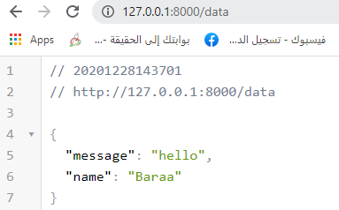
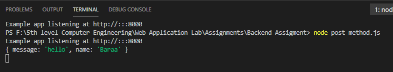
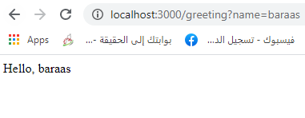

# Description for this assignment:
We have an index page with two forms, one for post and the other for get methods,such that when i enter the data in post form, it should return it in JSON format, and when i enter it in get form,it should sent in the URL.
 

